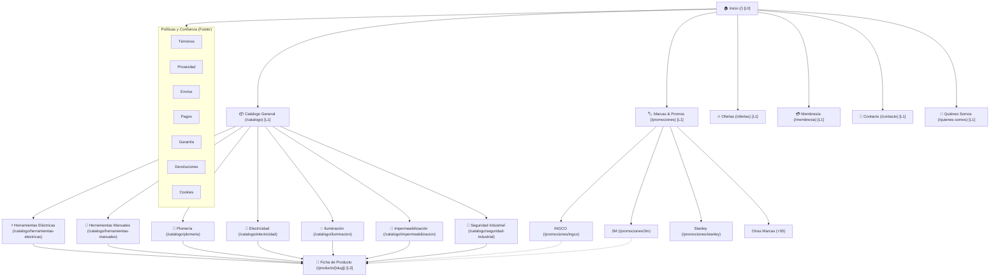

# Mapa del Sitio y Arquitectura de Información — CharaTools E-Commerce

> **Documento de Arquitectura y SEO Técnico**  
> **Conforme a:** `Skills/site-architecture.md`, `Skills/seo-structure-architect.md`, `Skills/nextjs-app-router-patterns.md`, `Skills/seo-audit.md`  
> **Proyecto:** CharaTools (Ferretería B2B / B2C en Charallave, Miranda)  
> **Dominio Canónico:** `https://charatools.com.ve` (Producción) / `https://charatools-frontend.vercel.app` (Staging)

---

## 1. Jerarquía de Páginas (L0 – L3) — Árbol ASCII

Conforme a la regla de los 3 clics (*3-Click Rule*), cualquier producto o categoría es alcanzable desde la página principal en un máximo de 2 a 3 transiciones:

```text
CharaTools Homepage (/) [L0]
├── Catálogo Principal (/catalogo) [L1]
│   ├── Herramientas Eléctricas (/catalogo/herramientas-electricas) [L2]
│   │   ├── Taladro Percutor INGCO (/producto/taladro-ingco-550w) [L3]
│   │   ├── Esmeril Angular INGCO (/producto/esmeril-ingco-820w) [L3]
│   │   └── ...
│   ├── Herramientas Manuales (/catalogo/herramientas-manuales) [L2]
│   │   ├── Juego de Destornilladores Stanley [L3]
│   │   └── ...
│   ├── Plomería (/catalogo/plomeria) [L2]
│   │   ├── Bomba Periférica 1/2 HP (/producto/bomba-periferica-1-2hp) [L3]
│   │   ├── Bomba Centrífuga 1 HP / 2 HP (/producto/bomba-centrifuga) [L3]
│   │   └── ...
│   ├── Electricidad (/catalogo/electricidad) [L2]
│   │   ├── Tableros Eléctricos (Con/Sin Puerta, Riel DIN, Puerta Fumé) [L3]
│   │   ├── Breakers THQC Superficial / THQL Empotrables (1P, 2P, 3P) [L3]
│   │   ├── Breakers Riel DIN (Steck / CHINT) [L3]
│   │   ├── Tomacorrientes e Interruptores (Línea 270, Decorativos, NEMA 10-50R, 20A) [L3]
│   │   ├── Enchufes Industriales y Tomas Aéreas (Eagle, Tania Wiring) [L3]
│   │   └── Canalización (Tubería PVC/EMT, Curvas 90°, Cajetines 4x2/4x4/Octogonal, Canaletas, Poliflex, BX) [L3]
│   ├── Iluminación (/catalogo/iluminacion) [L2]
│   │   ├── Paneles LED, Reflectores, Bombillos [L3]
│   │   └── ...
│   ├── Impermeabilización (/catalogo/impermeabilizacion) [L2]
│   │   ├── Mantos asfálticos, Primer, Selladores [L3]
│   │   └── ...
│   └── Seguridad Industrial (/catalogo/seguridad-industrial) [L2]
│       └── Cascos, lentes, guantes de carnaza, botas [L3]
├── Promociones & Marcas (/promociones) [L1]
│   ├── Promociones INGCO (/promociones/ingco) [L2]
│   ├── Promociones 3M (/promociones/3m) [L2]
│   ├── Promociones Bellota (/promociones/bellota) [L2]
│   ├── Promociones Stanley (/promociones/stanley) [L2]
│   └── [+50 Marcas Oficiales] (/promociones/[marca]) [L2]
├── Ofertas Especiales (/ofertas) [L1]
├── Club & Membresía (/membresia) [L1]
├── Institucional [L1]
│   ├── Quiénes Somos (/quienes-somos)
│   └── Contacto & Retiro en Tienda (/contacto)
└── Legal & Confianza [L1]
    ├── Términos y Condiciones (/terminos-y-condiciones)
    ├── Política de Privacidad (/politica-de-privacidad)
    ├── Política de Envíos (/politica-de-envios)
    ├── Métodos y Política de Pagos (/politica-de-pagos)
    ├── Política de Devoluciones (/politica-de-devoluciones)
    ├── Política de Garantía (/politica-de-garantia)
    └── Política de Cookies (/politica-de-cookies)
```

---

## 2. Diagrama de Arquitectura de Información (Mermaid)



---

## 3. Silos Temáticos y Clústeres de Autoridad (Siloing Strategy)

Para maximizar la autoridad temática en los motores de búsqueda (SEO local y nacional en Venezuela):

| Silo Temático | URL del Silo (Pilar) | Clústeres de Palabras Clave y Productos | Intención de Búsqueda |
| :--- | :--- | :--- | :--- |
| **Electricidad** | `/catalogo/electricidad` | Tableros eléctricos, breakers THQC, breakers THQL, riel DIN, tomacorrientes NEMA, cajetines EMT, tubería conduit, canaletas | Transaccional / Comercial |
| **Plomería & Bombas** | `/catalogo/plomeria` | Bombas centrífugas, bombas periféricas, tuberías termofusión PPR, válvulas de retención | Transaccional / Comercial |
| **Herramientas Eléctricas** | `/catalogo/herramientas-electricas` | Taladros percutores, esmeriles angulares, rotomartillos, sierras circulares | Transaccional |
| **Herramientas Manuales** | `/catalogo/herramientas-manuales` | Destornilladores, alicates, llaves combinadas, niveles, martillos | Transaccional |
| **Iluminación** | `/catalogo/iluminacion` | Paneles LED embutir/sobreponer, reflectores para intemperie, bombillos ahorradores | Transaccional |
| **Marcas Destacadas** | `/promociones/[marca]` | Distribuidor oficial INGCO, 3M Venezuela, Stanley, Bellota, Tezza, Eagle | De Marca / Navegacional |
| **Institucional & Local** | `/contacto`, `/quienes-somos` | Ferretería en Charallave, ferretería Valles del Tuy, retiro en tienda | Local / Geo-SEO |

---

## 4. Matriz de Enlazado Interno (Internal Linking Matrix)

| Desde | Hacia | Tipo de Enlace | Anchor Text Recomendado |
| :--- | :--- | :--- | :--- |
| `Header / Navbar` | `/catalogo`, `/ofertas`, `/promociones`, `/contacto` | Navegación Global | "Nuestro Catálogo", "Ofertas", "Contacto" |
| `MegaMenu` | Todos los silos `/catalogo/[category]` | Navegación Jerárquica | Nombre de Categoría con ícono temático |
| `Ficha de Producto` | Categoría padre (`/catalogo/[category]`) | Breadcrumb | Breadcrumb trail: `Inicio > [Categoría] > [Producto]` |
| `Ficha de Producto` | Productos relacionados | Carrusel de recomendación | "Productos Similares", "Completar Instalación" |
| `Página de Marca` | `/catalogo/[category]` y `/producto/[slug]` | Clúster contextual | Nombre de producto y categoría |
| `Footer` | Institucional y Legal | Pie de página global | "Quiénes Somos", "Términos", "Privacidad", "Envíos", RIF |

---

## 5. Implementación del Sitemap XML (`/sitemap.xml`)

La generación del Sitemap XML es automatizada en Next.js App Router mediante [`frontend/app/sitemap.ts`](file:///home/alejo/Documentos/Proyectos/Charatools-Eccomerce/frontend/app/sitemap.ts):

- **Frecuencia de Actualización:** `daily` para páginas transaccionales y catálogo; `weekly` para fichas de productos y marcas; `yearly` para legales.
- **Prioridad (0.0 a 1.0):**
  - `1.0`: Homepage (`/`)
  - `0.9`: Catálogo general (`/catalogo`)
  - `0.85`: Silos de categoría (`/catalogo/[category]`) y Ofertas (`/ofertas`)
  - `0.8`: Fichas de producto (`/producto/[slug]`) y Contacto (`/contacto`)
  - `0.7 - 0.75`: Páginas de marcas (`/promociones/[marca]`), Membresía y Quiénes Somos
  - `0.4`: Páginas legales (`/terminos-y-condiciones`, `/politica-de-privacidad`, etc.)
- **Respaldo Dinámico:** Consulta en vivo a la tabla `products` en Supabase con fallback a `MOCK_PRODUCTS` para asegurar que ningún producto quede sin rastrear.

---

## 6. Control de Rastreo (`/robots.txt`)

Configurado en [`frontend/app/robots.ts`](file:///home/alejo/Documentos/Proyectos/Charatools-Eccomerce/frontend/app/robots.ts):

- **Permitido:** Todo el catálogo público, fichas de productos, categorías y páginas institucionales.
- **Bloqueado:** Rutas de administración (`/admin`, `/admin/*`) y endpoints de API internos (`/api/*`).
- **Referencia a Sitemap:** `https://charatools.com.ve/sitemap.xml`.

---

## 7. Mapeo de Schemas Estructurados (JSON-LD)

| Tipo de Página | Schemas Requeridos | Propósito |
| :--- | :--- | :--- |
| **Sitio Global / Home** | `Organization`, `LocalBusiness`, `WebSite` | Identidad corporativa, geolocalización en Charallave, buscador en sitio |
| **Categorías (`/catalogo/[category]`)** | `CollectionPage`, `BreadcrumbList` | Jerarquía temática y rastreo de colecciones |
| **Páginas de Producto (`/producto/[slug]`)** | `Product`, `Offer`, `BreadcrumbList` | Rich snippets en Google (disponibilidad, marca, SKU, descripción) |
| **Contacto (`/contacto`)** | `ContactPage`, `LocalBusiness` | Datos de contacto, teléfono, mapa y horario comercial |
| **Quiénes Somos (`/quienes-somos`)** | `AboutPage`, `Organization` | Señales E-E-A-T (Experiencia, Autoridad, Confiabilidad) |
